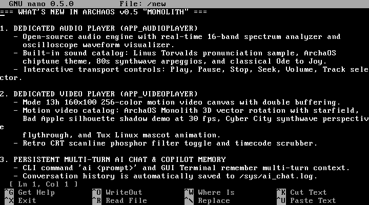
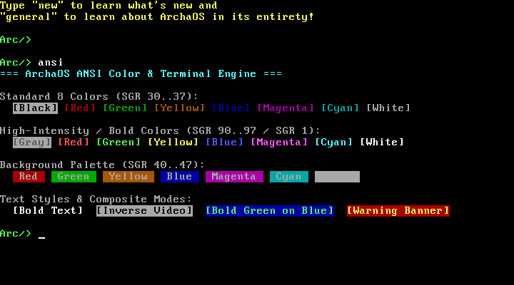
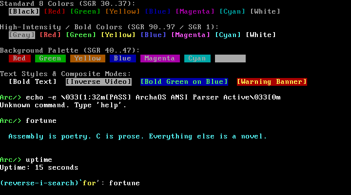
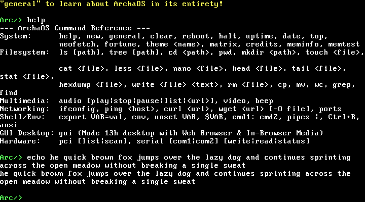

# ArchaOS v0.5 "Monolith"

**ArchaOS** is a hobby 32-bit x86 monolithic operating system written entirely from scratch in **C** and **x86 Assembly** — no Linux, no GRUB modules, no borrowed kernel code, and zero runtime libc dependencies.

It boots from an ISO image into a fully custom kernel featuring a brand-new **VGA graphical desktop environment**, an existing complete **interactive CLI shell**, a **virtual filesystem**, a super-simple **memory manager**, and a small suite of built-in GUI applications.

> ⚡ **Zero Persistent Disk Footprint**: ArchaOS runs 100% in ephemeral system memory (RAM). It never touches, writes to, or mounts persistent user disks (ATA/IDE). Every reboot gives a fresh, pristine environment.
>
> 📖 **Comprehensive Documentation**: Explore the [ArchaOS GitHub Wiki](https://github.com/AkshajCreator/ArchaOS/wiki) (or browse [`docs/wiki/`](docs/wiki/)) for in-depth architectural specifications, hardware driver details, GUI application guides, and build instructions.

---

## 📸 Screenshots

### Graphical Desktop (Mode 13h — 320×200, 256 colours)
- Full **window manager** — drag, minimise, maximise (fullscreen), split-screen snap, close
- **100% double-buffered** rendering — zero tearing, zero flickering, zero mouse trails
- **PS/2 mouse** support with hardware-accurate 3-byte packet parsing
- **Adaptive ProcessBar** (taskbar) with pixel-art program icons that scales with open windows
- **Start Menu** with an intricate vertical ArchaOS side banner
- Live **clock** reading directly from the CMOS RTC
- **4 themes** — Classic Teal, Win31 Navy, Matrix Green, Amber Gold
- **4 wallpapers** — Solid, Starfield, Cyber Grid, Sunset Lines
- Settings saved automatically to `archaos.conf` on the RAM disk

| Authentic GNU nano 0.5.0 Editor | Full ANSI Terminal Color Engine |
| :---: | :---: |
|  |  |

| Reverse History Search (`Ctrl+R`) | Intelligent Word Wrap |
| :---: | :---: |
|  |  |

---

## ✨ What's in ArchaOS v0.5

### 1. Advanced CLI Shell & Terminal Engine
- **Fish-Style Inline Autosuggestions**: As you type, commands match against history and system binaries, rendering a lookahead ghost suggestion in dim gray (`0x08`). Press **Right Arrow** or **Tab** to immediately accept.
- **Reverse Incremental History Search (`Ctrl+R`)**: Real-time backwards interactive history search with query prompt `(reverse-i-search)\`<query>': <match>`. Press `Ctrl+R` to cycle through earlier matches, `Enter` to run, `Tab`/`Right Arrow` to edit, or `ESC`/`Ctrl+C` to cancel.
- **Full ANSI Escape Sequence Engine**: In-kernel ANSI escape state machine supporting SGR foreground & background colors (30–37, 90–97, 40–47, 100–107 mapped to hardware VGA), bold, dim, inverse video, cursor positioning (`A/B/C/D`, `H/f`, save `s`, restore `u`), line/display erasing (`2J`, `2K`), and 8-column tab stop expansion.
- **Intelligent ANSI-Aware Word Wrap**: Text output, the interactive command prompt, and GNU nano dynamically calculate visible word lengths (ignoring ANSI tags) and cleanly wrap lines at whitespace boundaries instead of splitting words across columns.
- **Shell Productivity Shortcuts**: `Ctrl+L` (clear screen), `Ctrl+C` (cancel input line), `Ctrl+U` (clear before cursor), and 32-entry persistent history ring buffer (`Up`/`Down` arrows).

### 2. Authentic GNU nano 0.5.0 Micro-Editor
- Full interactive full-screen text editor (`nano <file>` or `edit <file>`).
- Classic inverted top title bar with active filename and `[Modified]` flag.
- 21-line text canvas with word wrap and dynamic cursor positioning.
- Status feedback row (`[ Ln X, Col Y ]`, write confirmations).
- Authentic two-row shortcut badge legend:
  - `^O WriteOut` — save directly to RAM VFS
  - `^K Cut Text` — cut line to clipboard
  - `^U Paste Text` — uncut / paste line from clipboard
  - `^X Exit` / `ESC` — exit safely back to shell

### 3. Universal Unix Pipelines & Semicolon Sequencing
- **Universal Pipeline Operator (`|`)**: Connect stdout of any command to stdin of another via ephemeral in-memory IPC pipe buffer (`help | grep Filesystem`, `fortune | wc`, `cat /general | less`).
- **Command Sequencing (`;`)**: Chain multiple commands sequentially on a single line (`mkdir /test; touch /test/file.txt; ls /test`).
- **Environment Variables**: Shell environment subsystem with `export VAR=val`, `env`, `unset VAR`, and runtime `$VAR` token substitution.

### 4. Mode 13h Graphical Desktop & In-Browser Media
- **Multi-Tier Window Shadows & Active Cyan Glow**: Windows cast soft ambient drop shadows on the desktop, and the currently focused window casts an active cyan perimeter glow.
- **Window Snapping & Fullscreen**: Drag windows to the left or right screen boundary to snap 50/50 split-screen; drag to top or double-click titlebar to toggle maximize (`320×187`).
- **Desktop File Icons & MIME Associations**: Dynamic desktop file icons with dedicated glyphs (`.txt`, `.wav`, `.vid`, `.py`) that automatically launch into their associated app on double-click.
- **Consolidated In-Browser Media Engine**: Integrated docked media toolbar directly inside the web browser with playback controls (`>`, `||`), dual timecode (`01:23 / 03:45`), hover-timestamp scrubber gauge, and fullscreen mode.
- **Speed Dial Bookmark Bar**: Instant one-click bookmarks (`Home`, `DuckDuckGo`, `Wikipedia`, `Media`) and `Ctrl+Tab` browser tab switching.
- **Interrupt-Driven Background Audio**: Programmable Interval Timer (PIT) IRQ0 audio scheduler (~100 Hz) that plays synthesized melodies, WAVs, and chiptunes continuously in the background while multitasking.

### 5. Bare-Metal Laptop & Pure UEFI Support (GOP Driver)
- **Universal Dual-Mode Graphics Engine**: Automatically detects UEFI GOP (Graphics Output Protocol) 32-bit linear framebuffers or legacy VGA BIOS (Mode 13h / text mode `0xB8000`).
- **Bare-Metal Class 3 UEFI Boot**: Full compatibility with modern Pure UEFI laptops (Intel 10th–14th Gen & AMD Ryzen) with zero CSM/Legacy BIOS requirements.
- **ISOHybrid Packaging**: Flash directly to any USB drive (`dd if=ArchaOS.iso of=/dev/sdX bs=4M conv=fsync`) or boot in QEMU/VirtualBox.

---

## 🖥️ Built-in GUI Applications

| Application | Description |
|---|---|
| **Web Browser** | NetSurf HTML engine, JS runtime, NanoSVG vector decoder, Speed Dial bookmarks, and universal docked media player |
| **Terminal CLI** | Embedded Mode 13h terminal window with live command execution and output capture |
| **App Studio** | Integrated IDE & Script Studio for editing and running native MicroPython and Tiny C Compiler (TCC) scripts |
| **File Manager** | RAM disk navigator with toolbar actions (+File, +Dir, Edit, Delete), item properties, and MIME launching |
| **Notepad** | Interactive text editor with full ASCII typing, blinking cursor, and RAM disk persistence |
| **Painter** | 256-color drawing tool with pencil, brush, eraser, flood fill, custom palette, and canvas clear |
| **Calculator** | 4-function arithmetic calculator with interactive button grid |
| **Minesweeper** | Classic 8×8 minefield with PRNG mine placement, right-click flagging, and win/loss detection |
| **Snake** | Retro arcade Snake game with score tracking, speed scaling, sound effects, and restart overlay |
| **Control Panel** | System configuration: switch between 4 themes and 4 wallpapers, saved to `archaos.conf` |
| **Task Manager** | Inspect active desktop windows, memory heap utilization, and kill processes |
| **Image Viewer** | Preview `.bmp` drawings and graphics with Open/Save controls |

---

## ⌨️ Shell Command Reference

| Category | Commands |
|---|---|
| **System** | `help`, `new`, `general`, `clear` / `cls`, `reboot`, `halt`, `uptime`, `date`, `top`, `neofetch`, `fortune`, `theme <name>`, `matrix`, `credits`, `meminfo`, `memtest` |
| **Filesystem** | `ls [path]`, `tree [path]`, `cd <path>`, `pwd`, `mkdir <path>`, `touch <file>`, `cat <file>`, `less <file>`, `nano <file>`, `head <file>`, `tail <file>`, `stat <file>`, `hexdump <file>`, `write <file> <text>`, `rm <file>`, `cp <src> <dst>`, `mv <src> <dst>`, `wc <file>`, `grep <pat> <file>`, `find` |
| **Networking** | `ifconfig`, `ping <host>`, `curl <url>`, `wget <url> [-O file]`, `ports` |
| **Shell & Env** | `export VAR=val`, `env`, `unset VAR`, `$VAR`, `cmd1; cmd2`, `cmd1 | cmd2`, `alias`, `unalias`, `run <script>`, `ansi` / `colors`, `echo [-e] <text>` |
| **AI Assistant** | `ai <prompt>` (persistent multi-turn chat), `ai clear`, `ai history` |
| **Multimedia** | `audio [play|stop|pause|next|prev|list]`, `video`, `beep` |
| **Hardware** | `pci [list|scan]`, `serial [com1|com2] [write|read|status]`, `ata` |
| **Graphical** | `gui` (enters Mode 13h desktop environment) |

---

## ⌨️ Keyboard Shortcuts Reference

| Context | Shortcut | Action |
|---|---|---|
| **CLI Shell** | `Tab` or `Right Arrow` | Accept inline autosuggestion |
| | `Ctrl + R` | Interactive reverse history search |
| | `Ctrl + L` | Clear screen buffer |
| | `Ctrl + C` | Cancel current command line |
| | `Ctrl + U` | Erase line before cursor |
| | `Up` / `Down` | Navigate command history |
| | `Shift + PgUp / PgDn` | Scroll terminal scrollback buffer |
| **GNU nano** | `Ctrl + O` | Write out / save to file |
| | `Ctrl + K` | Cut current line to clipboard |
| | `Ctrl + U` | Paste / uncut text from clipboard |
| | `Ctrl + X` / `ESC` | Exit editor |
| **GUI Desktop** | `Alt + Enter` / `F11` | Toggle window maximize / restore |
| | `Ctrl + W` / `Alt + F4` | Close focused window |
| | `Ctrl + Tab` | Cycle active browser tabs |
| | `Ctrl + +` / `Ctrl + -` | Adjust system volume HUD |
| | `ESC` | Return from GUI to CLI shell |

---

## 🛠️ Toolchain & Requirements

| Tool | Purpose |
|---|---|
| `gcc` | Freestanding C compiler (32-bit multilib) |
| `nasm` | x86 assembly assembler |
| `ld` | GNU ELF32 linker |
| `grub-mkrescue` | Multiboot ISO generator |
| `xorriso` | RockRidge ISO filesystem builder |
| `qemu-system-i386` | Emulation and testing |

### Install Dependencies (Debian / Ubuntu / Pop!_OS)
```bash
sudo apt update
sudo apt install -y gcc-multilib nasm binutils grub-pc-bin grub-common xorriso qemu-system-x86
```

---

## 🚀 Building & Running

### Build Classic Edition (VGA Mode 13h / BIOS / QEMU):
```bash
make clean && make iso
```
Produces `ArchaOS.iso`.

### Build UEFI Edition (Pure UEFI Class 3 / GOP):
```bash
make uefi
```
Produces `ArchaOS-UEFI.iso`.

### Run Classic in QEMU:
```bash
make run
```

### Run UEFI in QEMU (with OVMF):
```bash
make run-uefi
```

---

## 📂 Project Structure

```
ArchaOS/
├── assets/
│   └── screenshots/      # Desktop, terminal, nano, and browser media screenshots
├── boot/
│   └── grub/             # GRUB configuration
├── src/
│   ├── boot.asm          # Multiboot entry point, protected mode, FPU init
│   ├── isr_stubs.asm     # CPU exception & IRQ assembly stubs
│   ├── kernel.c          # Kernel main, CLI shell dispatcher, built-in commands
│   ├── vga.c             # VGA text driver, ANSI state machine, autosuggest, Ctrl+R, word wrap
│   ├── gui.c             # Mode 13h desktop compositor, window manager, browser, media player
│   ├── idt.c             # Interrupt Descriptor Table & PIC 8259A remap
│   ├── mm.c              # Heap memory allocator (kmalloc/kfree)
│   ├── fs.c              # Virtual in-memory filesystem (RAM disk)
│   ├── editor.c          # GNU nano 0.5.0 micro-editor
│   ├── shellext.c        # Unix pipelines |, ;, $VAR expansion, aliases
│   ├── audio.c / pit.c   # PIT IRQ0 background audio scheduler
│   ├── less.c            # Paginated interactive viewer (less/more) with dynamic word-wrap
│   ├── matrix.c          # Animated digital rain screensaver
│   ├── wget.c            # HTTP/Web download tool
│   ├── net/              # E1000 NIC driver, IP, UDP, TCP, DHCP, DNS, NetSurf & BearSSL
│   ├── ai.c              # Online AI assistant (NIM & DeepSeek via E1000 networking)
│   ├── pci.c / serial.c  # PCI enumeration & 16550 UART serial driver
│   ├── neofetch.c        # System information utility
│   ├── splash.c          # Animated boot splash
│   └── linker.ld         # Freestanding ELF32 linker script
├── Makefile
└── README.md
```

---

## 📜 Licence

- Type `gui` in the shell to launch the graphical desktop
- Press **ESC** inside the GUI to return to the shell
- **Right-click** in Minesweeper to place/remove a flag
- Type `help` in the shell for a full command list
- Theme and wallpaper changes in Control Panel are persisted in `archaos.conf`

*Crafted from scratch with ❤️ by [AkshajCreator](https://github.com/AkshajCreator)*
